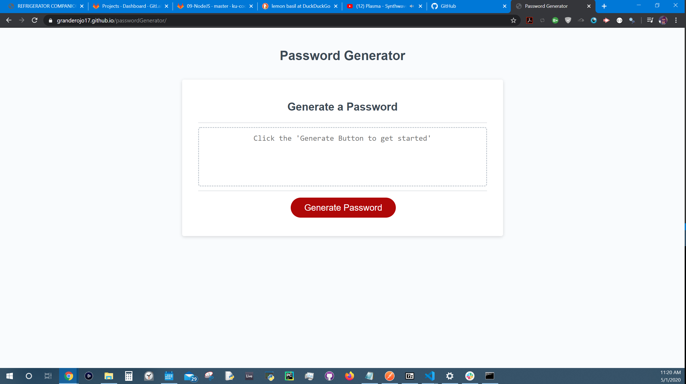
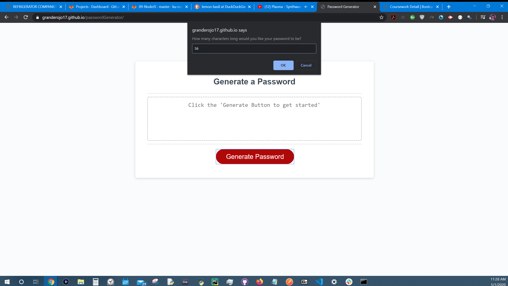
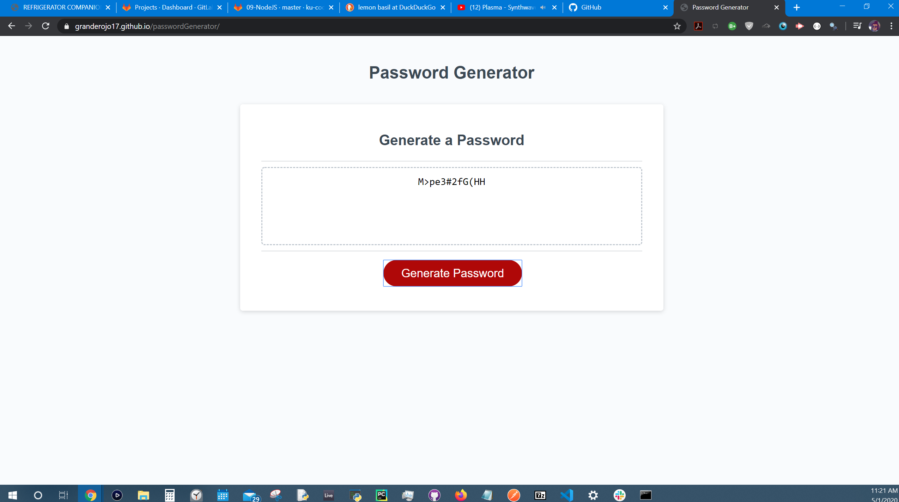

# A Random Password Generator - David Yennerell

### Re-adjusted and re-submitted April 5th, 2020.

[Click here to try out the 'Password Generator' for yourself.](https://granderojo17.github.io/passwordGenerator/ "Password Generator GitHub Link")

- Using Javascript to store the possible characters inside of some arrays. The characters are grouped according to 'numbers', 'special characters', 'upper case' and or 'lower case' and the characters can be toggled **on** or **off** by the user.

# 1. Follow the instruction on inside the text box to get started.

The side populates a questionaire **using prompts** asking the user to help define the guidelines to make a randomly generated password.

## 2. Using prompts either click **'ok'** for yes or **'cancel'** for no .

## 3. The password will generate and populate the text box on the screen with a password to be copied by the user.

